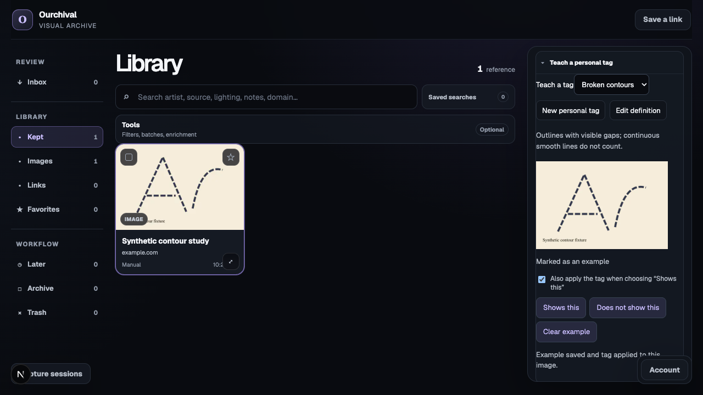

# Personal tags and shared identities

Implemented on the search-first branch and integrated into the Air Blue local vault. See [rollout details](METADATA_MIGRATION.md).

In **Tools → My tag definitions**, create a tag or select an existing tag to
rename it and describe its meaning. Existing reference and image assignments
retain the same tag ID. Renaming also retains its original filter slug, so
existing `tag:` links remain valid. Previous names become search aliases. A
coalesced background search rebuild updates keyword lookup; names in the current
browser's tag catalog update immediately after saving. Other browser sessions
refresh their catalog on reload.

In an image's inspector, open **Teach a personal tag**, choose a definition, and
mark each displayed image as an example or counterexample. You can create or edit its definition in this panel, and the selected tag stays with you as you move between images. Clear an accidental
choice with **Clear example**. Teaching only assigns a saved image tag when you explicitly check the option beside the positive-example button. The existing saved-tag editor and batch tools remain available.

Definitions have versions separate from edit revisions. Renaming alone preserves
the meaning version. Changing the definition records its new version and keeps
previous definition text. Earlier examples remain visible as needing review and
are excluded from the current training export. Example records store the current
owner choice per tag/image, not a full edit history. Automatic classification or
archive-wide propagation of personal concepts is not enabled in this release.

## Storage and compatibility

The existing shared `tags` catalog remains authoritative; no parallel vocabulary
is created. New tags receive immutable positive uint32 codes. Existing tags gain
a code when their definition is edited, preserving every existing document ID
and assignment. Code allocation is transactional and sequential within batch
assignment; codes are never recycled. Reaching uint32 capacity requires an
explicit format upgrade rather than wrapping an ID.

Current reference/image links continue using native Convex IDs. Definitions and
examples are separate linked records. Names and meanings are not repeated on
each example. The resumable metadata migration assigns missing codes and converts legacy machine results. New machine results now use a shared term dictionary and shared model records; see the migration guide for compatibility details.

`workers/visual/tag_codec.py` supplies a tested opt-in binary format for sparse
code/score payloads: a versioned header, count, sorted uint32 IDs and float64
scores. It rejects duplicate/invalid IDs, malformed lengths and unknown versions.
It does not quantize scores. The shared dictionary and recipe must accompany a
payload through their own stable identity; the payload is not self-describing.
The version byte reserves an explicit future format migration path.

On the 48-image private pilot, 5,747 ConvNeXt assertions used 1,759 unique terms.
Compact JSON tag arrays occupied 437,247 bytes. Version-1 payloads plus the
experiment's shared JSON dictionary occupied 114,879 bytes, about 74% less.
All 48 encoded payloads decoded exactly. This measures payload bytes only, not
Convex documents, search indexes, provenance overhead or total archive storage.
The experimental dictionary is private and is not the live catalog's code map.

## Interfaces and limits

All public functions require existing owner access:

- `tags:createDefinition`: atomic creation, rejecting collisions with names,
  aliases and stable slugs.
- `tags:editDefinition`: expected edit revision, name and full definition;
  stale writes fail without changes.
- `tags:setExample`: tag ID, asset ID, current definition version and positive /
  negative / null-to-clear choice.
- `tags:examplesForAsset`: inspect a prior choice, including an old version.
- `tags:listExamples`: paginated current-version training inputs, up to 32 rows
  per page. Deleted/missing references and old-version examples are excluded.
  Owned Convex image URLs are provided when available; unavailable derivatives
  have a null URL. A worker must skip or resolve those through the owned media
  pipeline. Definition changes require restarting enumeration.

Definitions are capped at 2,000 characters and retained names at 64. These reuse
the existing catalog's 48-character tag-name and slug normalization rules.
Name/alias collision checks currently scan the existing shared tag catalog;
this follows the existing catalog listing design and should become a dedicated
name index before machine-vocabulary-scale ingestion. Multi-page example export
is not a frozen training snapshot: a training worker must fingerprint the exact
examples it consumes and record input identities. No hosted image submissions
are made by these interfaces.

## Validation

137 archive-branch repository tests, 45 Python tests, full typechecking and the production build
passed. Integration coverage includes
rename/assignment preservation, aliases in search, collision rejection, stale
edit rejection, definition history, stale-example exclusion, clearing examples,
legacy identity preservation, owner authentication and batch code uniqueness.
Codegen, schema deployment and browser exercises used an isolated local Convex
catalog with a synthetic linework image. The browser verified creation, rename,
positive/negative selection and clearing, with visual checks at 1440×900 and
1280×720. No live archive references or original media were modified.

