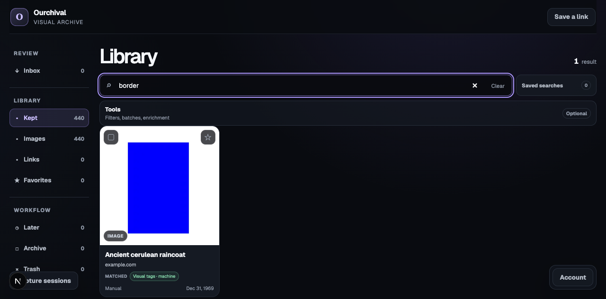
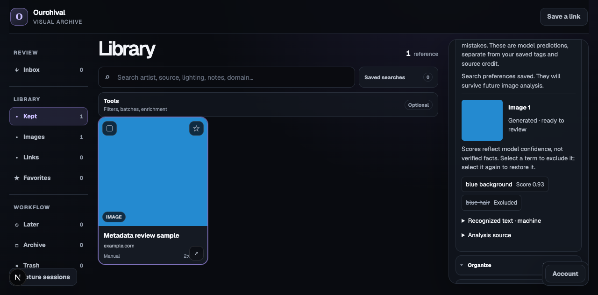

# Visual search integration validation

Validated September 5, 2026 on the Mac. The archive branch is based directly on
`main` (`99a1e01`), independently of the extension/local-first-vault branch.
The supplied visual module was merged with the existing color/hash endpoints.
No production archive was used for validation.

## Repository checks

- `pnpm test`: 129 Vitest tests pass on the independent archive branch.
- `python -m unittest discover -s workers/visual/tests -v`: 33 tests pass under
  Python 3.14.6. A Linux-specific temporary-path assertion was corrected for macOS.
- `pnpm typecheck`: passes, with the new backend entry points included.
- Convex codegen and a local deployment with typechecking: pass.
- `pnpm build`: web and extension builds pass; pre-existing React hook warnings
  remain in unrelated UI components.

Ten native `convex-test` integration tests cover old-reference retrieval,
collection/favorite restrictions, pre-backfill cursors, indexed pagination,
revision conflicts/replay, human corrections, unchanged storage bytes, existing
color/hash endpoints, owner authentication, image metadata, and source refresh.
The metadata tests additionally cover sparse source refreshes and field origins,
historical first/latest recovery, duplicate prediction normalization, stale
analysis, correction concurrency and preservation across new model results.
These are backend emulation tests; the separate local-server exercise below used
an actual Convex backend and search index.

Regenerating API bindings exposed existing backend typing problems, which were
fixed rather than suppressing checks. The source-metadata processor is now an
internal action, matching its existing internal callers. Fresh counter bootstrap
and board counts now iterate a query rather than calling `paginate` repeatedly
inside one transaction (which failed on a real backend above 256 references).
The one-time counter bootstrap still has Convex's transaction read limits; this
change does not make that older bootstrap an unlimited background migration.

## Actual local-server exercise

The initial integration, before separating from the extension branch, used an
isolated local Convex instance with 440 synthetic references and one generated
256 × 256 blue rectangle PNG. Temporary internal fixture functions were removed
before publication of the branch.

- Before backfill, the old reference was outside the HTTP fallback scan window.
- Backfill completed and the old reference appeared on the first indexed page.
- A 28-match query paginated without duplicates or omissions.
- The worker computed one real WD/SigLIP result without publication.
- Cached-only publication wrote that result with zero new inference tasks.
- A WD-generated term (`border`) retrieved the reference through the HTTP gallery
  API with a machine-field match explanation.
- Real SigLIP image and text embeddings supported local cosine lookup.
- Fetching the original stored upload after processing produced the same SHA-256
  as the uploaded bytes.
- The existing derivative pipeline later changed the input identity; a subsequent
  sync recomputed/published the current preview, exercising resumption after an
  asset change. Stale annotations are intentionally excluded until recomputed.

The existing browser gallery was verified at 1280 × 633: searching `cerulean`
found the old reference, and `border` displayed its real preview with the
“Visual tags · machine” match badge.

On the independent archive branch, a fresh local Convex deployment and browser
session tested the new metadata panel using a blue square and explicitly
synthetic predictions. The image appeared beside its terms. Excluding `blue_hair`
changed the control to “Excluded”; a subsequent gallery search for `hair` returned
zero results while the reference remained in the library. The OCR inclusion
control also saved successfully. This fixture tests correction behavior, not
model accuracy. Missing/stale states and concurrent edits have backend test
coverage; their browser presentation has not received a separate manual check.

## Real-model runtime

| Component | Validated configuration |
| --- | --- |
| Python | 3.14.6 |
| ONNX Runtime / WD | 1.29.0, CPUExecutionProvider |
| PyTorch / SigLIP | 2.14.0, MPS, float32 |
| Transformers | 5.16.1 |
| NumPy / Pillow | 2.5.2 / 12.3.0 |
| WD revision | `d39e46de298d27340111b64965e20b8185c407e6` |
| SigLIP revision | `3f9f96cb90da5dbc758b01813f2f6f1aee24c1ab` |

One observed run took 4.817 seconds to load models, 0.610 seconds to compute and
cache one image, 0.009 seconds to publish its cached result, and 0.014 seconds for
a semantic query. Peak process RSS was 1,291.6 MiB; this is not a complete measure
of device memory. These single-sample timings are not p50/p95 measurements or
throughput guarantees. The model loader emits nonfatal BOS/EOS configuration
warnings with this Transformers version; image/text inference completed.

## Remaining validation

The synthetic image and single-item semantic index verify execution, not retrieval
quality. A representative 250-image / 25–40-query pilot, OCR model compatibility
and quality, Big Red/NVIDIA execution, and hosted development/production rollout
remain pending. No archive-wide inference or production annotation publication
was performed. Browser semantic search is not implemented in this slice.
